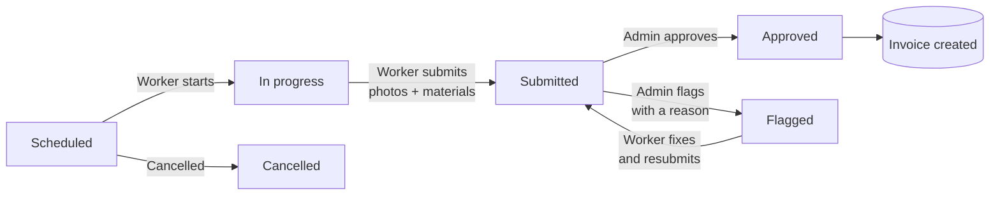
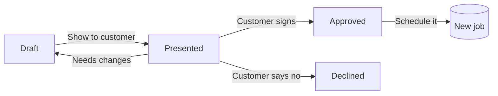
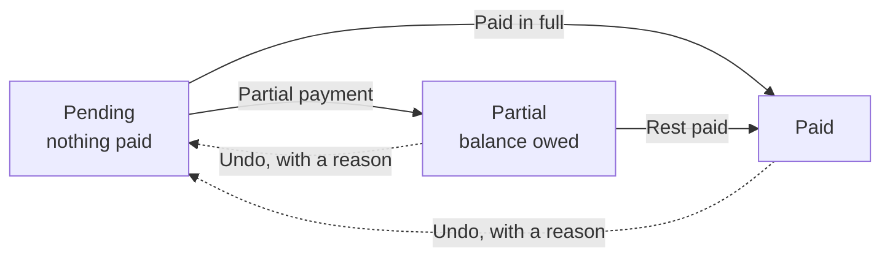
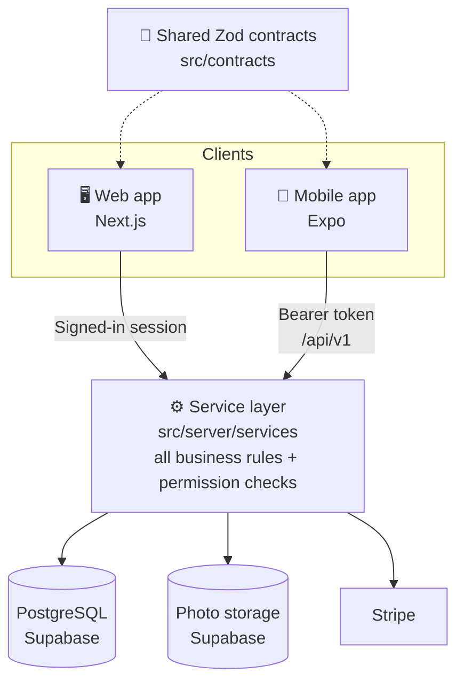

<div align="center">

# Complete Pool App

**Run a pool service company from one place: office on the web, crew on the phone.**

[](https://complete-pool-app.vercel.app)


</div>

---

## What is this?

Complete Pool App is a business management system built for a real pool service company. It replaces paper schedules, spreadsheets, and text messages with one system:

- The **office** uses the web app to schedule jobs, manage clients, send invoices, track stock, and see how the business is doing.
- The **crew** uses the mobile app in the field to see their day, take before and after photos, log the chemicals they used, and get estimates signed on the spot.
- The **customer** gets a numbered invoice with a QR code and can pay online by card, Apple Pay, or Google Pay.

> **Try it:** open the [live app](https://complete-pool-app.vercel.app) and click **Explore the demo** to look around as a read-only admin. Nothing you do there changes real data.

## Contents

| Start here | How it works | Reference |
| --- | --- | --- |
| [What it does](#what-it-does) | [A day in the life of a job](#a-day-in-the-life-of-a-job) | [Data model](#data-model) |
| [Who uses it](#who-uses-it) | [How it's built](#how-its-built) | [API endpoints](#api-endpoints) |
| [Run it locally](#run-it-locally) | [Security](#security) | [Environment variables](#environment-variables) |
| [Mobile app](#mobile-app) | [Testing](#testing) | [Project structure](#project-structure) |

---

## What it does

| Area | What you can do |
| --- | --- |
| 📅 **Scheduling** | Book jobs on a day, week, or month calendar. Set jobs to repeat daily, weekly, every two weeks, or monthly. The app blocks bookings outside business hours and warns when a worker is double-booked. |
| 🗺️ **Daily route map** | See every stop for the day on a map, with one-tap Google Maps directions for a single stop or the whole route. |
| 📸 **Field work** | Workers start a job, take before and after photos, log materials used, and submit it. An admin then approves it or sends it back with a note. |
| 👥 **Clients and pools** | Keep each client's contact info and all of their pool locations, with job and billing history on one page. |
| 📝 **Estimates** | Build a quote from your service list, add taxes, show it to the customer, and capture their signature on screen. A signed quote turns into a scheduled job with one click. |
| 💵 **Billing** | Approved jobs become invoices automatically. Take cash, check, or card. Partial payments are tracked, and mistakes can be undone with a reason on record. |
| 💳 **Online payments** | Every invoice has a pay link and QR code. Customers pay through Stripe, and the payment is recorded on its own. |
| 🧪 **Inventory** | Track chemicals and parts, get low-stock warnings, and see every stock change. Workers can request materials from the field. |
| 👷 **Team and payroll** | Add staff, set roles and pay rates, and see each worker's weekly hours and pay. |
| 📊 **Business numbers** | The owner sees revenue, margin, material cost, hours, and per-worker performance. |
| 🔔 **Notifications** | Live in-app alerts when schedules or services change. |

## Who uses it

There are three roles. Each one sees only what they need.

| | 👑 Owner | 🛠️ Admin | 🧑‍🔧 Worker |
| --- | --- | --- | --- |
| **Their job** | Watches the business | Runs the office | Does the work |
| **Calendar** | View | Full control | Own jobs, no prices |
| **Clients, scheduling, review** | | ✅ | |
| **Estimates** | | ✅ | ✅ |
| **Billing** | View only | ✅ | |
| **Materials and settings** | | ✅ | |
| **Team management** | ✅ | ✅ | |
| **Business numbers (KPIs)** | ✅ | | |
| **Own day and job list** | | | ✅ |

**Fair rules for managing people:**

- You can only manage people **below** your role. An admin can manage workers but not other admins or the owner.
- You can give someone a role **up to** your own, never above it.
- The last active manager can't be removed, so the company can't lock itself out.
- Turning off an account signs that person out everywhere, right away.

---

## A day in the life of a job

### 1. The job



- Materials are counted **once**, even if a job goes back and forth for fixes.
- If a job is cancelled after materials were logged, the stock is put back.
- Repeating jobs are created automatically every morning by a scheduled task.

### 2. The estimate



Once an estimate is shown to the customer, its prices and taxes are locked. Changing the service list later never changes what the customer signed.

### 3. The invoice



- **Payment types:** cash, check (check number required), or online card.
- Invoices (`INV-000042`) and receipts have their own numbers and come out as branded PDFs.
- Customers can't pay more than they owe, and an online payment is never counted twice.

---

## How it's built

All business rules live in **one place**. The web app and the mobile app are thin layers that call the same code, so they can never disagree.



- **Permissions are checked twice:** once at the page or route, and again inside every service.
- **Shared contracts:** the web API and the phone use the same Zod schemas, so sending the wrong data fails at build time on the phone, not in front of a customer.
- **Time zones done right:** every date uses the business's time zone from Settings, not the server clock.

| Layer | Technology |
| --- | --- |
| Web | Next.js 14, React 18, TypeScript, App Router, Server Actions, Tailwind CSS |
| Mobile | Expo SDK 57, expo-router, React Native |
| Database | PostgreSQL on Supabase with row level security, Prisma ORM |
| Files | Supabase Storage (private, short-lived links) |
| Sign-in | NextAuth (web), JWT access and refresh tokens with `jose` (mobile) |
| Payments | Stripe Checkout and webhooks |
| Maps | Leaflet, OpenStreetMap geocoding, Google Maps directions |
| Documents | @react-pdf/renderer, QR codes |
| Calendar | FullCalendar |
| Tests | Jest, Testing Library, jest-expo |
| Hosting | Vercel (app and scheduled jobs), Supabase (database and storage) |

## Security

| Protection | How it works |
| --- | --- |
| 🔑 Passwords | Stored only as bcrypt hashes |
| 🚫 Wrong passwords | 3 misses locks the account for 30 seconds. 20 misses from one network locks that network for 15 minutes. |
| 🕵️ No account guessing | An email that doesn't exist behaves exactly like one that does |
| 📱 Phone sign-in | 15-minute access token, 30-day refresh token that changes on every use. A stolen, reused token signs out the whole chain. |
| 🧱 Rate limits | Sign-in: 20 requests per 5 minutes per network. Token refresh: 60 per 5 minutes. |
| 🖼️ Photos | Private bucket, links expire quickly, old photos deleted automatically (default 183 days) |
| 💳 Pay links | Random secret per invoice, can't be guessed from an invoice number |
| ⏰ Scheduled jobs | Protected by a secret key |
| 🗄️ Database | Row level security turned on |

---

## Run it locally

**You need:** Node.js, npm, and a free [Supabase](https://supabase.com) project.

```bash
# 1. Install
npm install

# 2. Add your settings (see "Environment variables" below)
cp .env.example .env

# 3. Create the tables and sample data
npx prisma migrate deploy
npm run prisma:seed

# 4. Start
npm run dev
```

Open **http://localhost:3000**.

<details>
<summary><b>All npm scripts</b></summary>

| Command | What it does |
| --- | --- |
| `npm run dev` | Start the dev server |
| `npm run build` | Generate Prisma client and build for production |
| `npm run start` | Start the production server |
| `npm run prisma:generate` | Regenerate the Prisma client |
| `npm run prisma:migrate` | Create a migration (local database only) |
| `npm run prisma:deploy` | Apply migrations to a deployed database |
| `npm run prisma:studio` | Open Prisma Studio |
| `npm run prisma:seed` | Add sample data |
| `npm test` | Run all tests |
| `npm run test:watch` | Re-run tests on save |
| `npm run test:coverage` | Tests with a coverage report |

</details>

## Mobile app

The phone app lives in [`mobile/`](./mobile). It has two sides:

- **Workers:** today's jobs, start and submit work, photos, materials, material requests, and estimates with on-screen signatures.
- **Admins and owners:** dashboard, team schedule, review queue, everyone's route on a map, clients, billing, invoices and receipts to share, stock, team, settings, and business numbers. The owner sees it read-only.

```bash
cd mobile
npm install --legacy-peer-deps
npm start
```

Scan the QR code with Expo Go. To use your own server, set `EXPO_PUBLIC_API_URL` in `mobile/.env` to your computer's network address (not `localhost`, which on a phone means the phone).

Android builds are installable APKs from EAS, and small fixes reach phones over the air without a reinstall. Details in [mobile/README.md](./mobile/README.md).

## Deployment

Hosted on **Vercel** with a **Supabase** database. Two jobs run every day:

| Time (UTC) | Job |
| --- | --- |
| 04:00 | Delete photos past their retention period |
| 06:00 | Create the next repeating jobs |

Step-by-step guide: [DEPLOY.md](./DEPLOY.md). To connect Stripe, run [`scripts/stripe-webhook-setup.js`](./scripts/stripe-webhook-setup.js).

## Testing

Tests run with **no database**. Code that talks to Prisma uses a mock ([`src/test/prismaMock.ts`](./src/test/prismaMock.ts)), so the suite is fast and works anywhere.

<details>
<summary><b>What the tests cover</b></summary>

| Area | Covered |
| --- | --- |
| Time zones | Business-local clock, daylight saving changes, day/week/month starts |
| Scheduling | Business hours, double-booking, time parsing, repeating jobs |
| Billing | Partial and full payments, balance limits, undo, invoice totals, tax splits |
| Payroll | Weekly hours, pay rounding, which jobs count |
| Permissions | Who can manage and promote whom |
| Sign-in protection | Account lockout, network limits |
| Materials | Usage, stock changes, price snapshots, no double counting |
| Services | Permissions, job lifecycle, photos, users, routes, online payments |
| Tokens | Issuing, rotating, and catching reused tokens |
| Components | Payment and material forms |
| Mobile | Job data hooks |

Tests sit in `__tests__` folders next to the code they check.

</details>

---

## Reference

<details>
<summary><b>Data model</b> (27 tables)</summary>

### Data model

| Group | Table | Holds |
| --- | --- | --- |
| People | `User` | Name, email, role, pay rate, hire date, active or not |
| | `PayRateChange` | History of every pay change and who made it |
| Customers | `Client` | Customer contact and billing address |
| | `Pool` | A service location, with size, type, and map position |
| Work | `Task` | A job: client, pool, worker, service, time, price, status |
| | `RecurrenceRule` | How often a job repeats |
| | `TaskExtra` / `TaskMaterial` | Add-ons and materials on a job, with prices at that time |
| | `Photo` | Before and after photos |
| Catalog | `Service` / `ExtraService` / `TaxRate` | What you sell and the taxes you charge |
| Quotes | `Estimate` / `EstimateLineItem` / `EstimateTax` | A quote, its lines, and its locked taxes |
| Money | `Bill` | An invoice with its number and pay link |
| | `Payment` | Money received, with receipt number |
| | `PaymentReversal` | Record of every undone payment and why |
| Inventory | `Material` | Stock item, cost, sale price, quantity, reorder level |
| | `StockMovement` | Every stock change |
| | `MaterialRequest` | Worker requests for materials |
| System | `AppSettings` | Business hours, time zone, company details for invoices |
| | `Notification` | In-app alerts |
| | `RefreshToken` / `LoginAttempt` / `LoginSource` / `ApiRateLimit` | Sign-in security |

Full schema: [`prisma/schema.prisma`](./prisma/schema.prisma).

</details>

<details>
<summary><b>API endpoints</b> (used by the mobile app)</summary>

### API endpoints

Base path: `/api/v1`. Send `Authorization: Bearer <token>`. Every error looks the same:

```json
{ "error": { "code": "NOT_FOUND", "message": "That job doesn't exist." } }
```

| Code | HTTP | Meaning |
| --- | --- | --- |
| `VALIDATION` | 400 | The data sent is wrong |
| `UNAUTHENTICATED` | 401 | Not signed in |
| `FORBIDDEN` | 403 | Signed in, but not allowed |
| `NOT_FOUND` | 404 | It doesn't exist |
| `CONFLICT` | 409 | Clashes with something else |
| `STATE` | 422 | Not possible right now (for example, approving a cancelled job) |
| `RATE_LIMITED` | 429 | Too many requests |
| `INTERNAL` | 500 | Something broke on the server |

**Sign-in and account**

| Method | Path | Does |
| --- | --- | --- |
| POST | `/auth/login` | Sign in |
| POST | `/auth/refresh` | Get a new access token |
| POST | `/auth/logout` | Sign out |
| GET | `/auth/demo` | Is the demo login on? |
| GET, PATCH | `/me` | My profile |
| POST | `/me/password` | Change my password |

**Jobs**

| Method | Path | Does |
| --- | --- | --- |
| GET, POST | `/tasks` | List or create jobs |
| PATCH | `/tasks/:id` | Edit or move a job |
| POST | `/tasks/:id/start` · `/submit` · `/finish` | Move the job forward |
| POST | `/tasks/:id/approve` · `/flag` · `/cancel` | Admin decisions |
| POST | `/tasks/:id/end-series` | Stop a repeating job from here on |
| GET, POST | `/tasks/:id/photos` | List or add photos |
| POST | `/tasks/:id/photos/upload-url` | Get a photo upload link |
| DELETE | `/photos/:id` | Delete a photo |
| GET | `/agenda` · `/day-route` · `/scheduling/catalog` | My day, the route map, form options |

**Clients**

| Method | Path | Does |
| --- | --- | --- |
| GET, POST | `/clients` | Search or add clients |
| GET, PATCH, DELETE | `/clients/:id` | View, edit, delete a client |
| POST | `/clients/:id/pools` | Add a pool |
| PATCH, DELETE | `/pools/:id` | Edit or delete a pool |

**Estimates**

| Method | Path | Does |
| --- | --- | --- |
| GET, POST | `/estimates` | List or start an estimate |
| GET | `/estimates/catalog` | Options for building one |
| GET, DELETE | `/estimates/:id` | View or delete |
| POST, DELETE | `/estimates/:id/line-items[/:lineId]` | Add or remove a line |
| POST, DELETE | `/estimates/:id/taxes[/:taxId]` | Add or remove a tax |
| POST | `/estimates/:id/present` · `/draft` · `/sign` · `/decline` | Move it through its steps |
| POST | `/estimates/:id/schedule` | Turn a signed estimate into a job |

**Billing**

| Method | Path | Does |
| --- | --- | --- |
| GET | `/bills` · `/bills/:id` | List or view invoices |
| POST | `/bills/:id/payments` | Record a payment |
| POST | `/bills/:id/reverse` | Undo payments, with a reason |
| GET | `/bills/:id/invoice` · `/bills/:id/receipts/:paymentId` | Download PDFs |

**Materials**

| Method | Path | Does |
| --- | --- | --- |
| GET | `/materials` | Stock list with low-stock flags |
| GET, POST | `/materials/catalog` | Catalog, add an item |
| PATCH | `/materials/:id` | Edit an item |
| POST | `/materials/:id/toggle` · `/stock` | Retire an item, restock or adjust |
| GET, POST | `/material-requests` | List or make requests |
| GET | `/material-requests/pending` | Requests waiting for an answer |
| POST | `/material-requests/:id/respond` | Approve or deny |

**Team, settings, numbers, alerts**

| Method | Path | Does |
| --- | --- | --- |
| GET, POST | `/users` · GET `/users/:id` | List, add, view staff |
| POST | `/users/:id/role` · `/toggle-active` · `/password` | Change role, turn on/off, reset password |
| PUT | `/users/:id/employment` | Pay rate and dates |
| GET | `/settings` | All settings |
| PUT | `/settings/hours` · `/settings/company` | Hours, time zone, company details |
| POST, PATCH, DELETE | `/settings/services` · `/settings/extras` · `/settings/tax-rates` | Edit the catalog and taxes |
| GET | `/kpi` | Business numbers |
| GET, POST | `/notifications` | Alerts, mark as read |

**Outside `/api/v1`:** `/api/stripe/webhook` (Stripe), `/api/notifications/stream` (live alerts), `/api/cron/recurrence` and `/api/cron/photo-retention` (daily jobs).

</details>

<details>
<summary><b>Environment variables</b></summary>

### Environment variables

| Variable | Needed? | What it's for |
| --- | --- | --- |
| `DATABASE_URL` | ✅ Yes | Main database connection (Supabase pooler, port 6543) |
| `DIRECT_URL` | ✅ Yes | Connection for migrations (port 5432) |
| `NEXTAUTH_SECRET` | ✅ Yes | Signs sessions and tokens. Make one with `openssl rand -base64 32` |
| `NEXTAUTH_URL` | ✅ Yes | The app's address, `http://localhost:3000` locally |
| `CRON_SECRET` | In production | Protects the daily jobs |
| `SUPABASE_SERVICE_ROLE_KEY` | For photos | Creates photo links. Keep it on the server only |
| `SUPABASE_URL` | Optional | Worked out from `DATABASE_URL` if empty |
| `PHOTO_RETENTION_DAYS` | Optional | How long to keep photos (default 183) |
| `STRIPE_SECRET_KEY` | Optional | Turns on card payments |
| `STRIPE_WEBHOOK_SECRET` | With Stripe | Verifies messages from Stripe |
| `APP_URL` | Optional | Address used in pay links and QR codes |
| `BUSINESS_TZ` | Optional | Starting time zone before Settings are saved |
| `DEMO_LOGIN_PASSWORD` | Optional | Shows the public demo button |
| `EXPO_PUBLIC_API_URL` | Mobile, optional | Server the phone app talks to |

</details>

<details>
<summary><b>Project structure</b></summary>

### Project structure

```
src/
  app/              Web pages: calendar, clients, estimates, billing, materials,
                    review, settings, users, kpi, worker, pay (public pay page)
  app/api/          v1 REST API, Stripe webhook, live alerts, daily jobs
  components/       Shared UI pieces
  contracts/        Zod schemas shared with the phone app
  lib/              Billing, scheduling, time zone, payroll helpers
  server/
    services/       All business rules (used by web and mobile)
    api/            Token sign-in, rate limits, error format
    payments/       Stripe
    storage/        Photo storage
  middleware.ts     Role-based page protection
mobile/             Expo app: worker side and manager side
prisma/             Database schema, migrations, sample data
scripts/            Stripe webhook setup, demo user setup
```

</details>

---

<div align="center">

Built by **Saul Hernandez** · [GitHub](https://github.com/sahc1987) · [LinkedIn](https://linkedin.com/in/saul-hernandez-dev)

</div>
